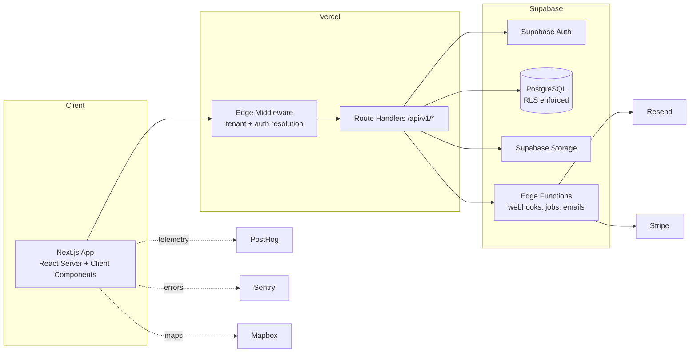

# STEMORA — Platform Architecture

Status: **DRAFT — awaiting approval. No application code has been written.**
Owner: Lead Software Engineer / Product Designer / DevOps / Security / DB Architect (Claude)
Last updated: 2026-08-01

This document is the entry point into the full architecture set for STEMORA, the
global platform for STEM Clubs (Google Classroom + GitHub + Discord + LinkedIn +
Notion + Trello, purpose-built for STEM clubs, multi-tenant across schools).

Per `stemora.md`, this is a planning deliverable only. Implementation begins only
after this document (and its sub-documents) is explicitly approved.

## How this document set is organized

| Doc | Covers |
|---|---|
| [docs/architecture/milestones-and-roadmap.md](docs/architecture/milestones-and-roadmap.md) | Milestones, MVP → production roadmap, launch gates |
| [docs/architecture/database-schema.md](docs/architecture/database-schema.md) | Full data model, DDL, indexes, RLS strategy |
| [docs/architecture/folder-structure.md](docs/architecture/folder-structure.md) | Repo layout, feature-first architecture |
| [docs/architecture/routes-and-pages.md](docs/architecture/routes-and-pages.md) | Every route, page, and layout, by audience |
| [docs/architecture/authentication.md](docs/architecture/authentication.md) | Signup/login/invite/session flows |
| [docs/architecture/rbac.md](docs/architecture/rbac.md) | Roles, permission matrix, enforcement layers |
| [docs/architecture/multi-tenancy.md](docs/architecture/multi-tenancy.md) | Tenant resolution, isolation guarantees |
| [docs/architecture/api-structure.md](docs/architecture/api-structure.md) | Route handler conventions, Edge Functions, versioning |
| [docs/architecture/component-library.md](docs/architecture/component-library.md) | Design system, shared components, states |

## System at a glance

Core architectural commitments (non-negotiable, per `stemora.md`):

1. **Multi-tenant by construction.** Every tenant-owned table carries `school_id`. No query, index, or RLS policy is written without it. See [multi-tenancy.md](docs/architecture/multi-tenancy.md).
2. **Authorization is server-side and DB-side, always.** Client-side role checks are UX sugar only. See [rbac.md](docs/architecture/rbac.md).
3. **Feature-first, not layer-first.** Business logic lives in `features/*/server`, never in components. See [folder-structure.md](docs/architecture/folder-structure.md).
4. **Every screen ships with loading / empty / error / success states**, permission checks, validation, and responsive + accessible markup, per the general rules in `stemora.md`.
5. **Premium SaaS bar.** Visual and interaction quality target: Linear, Notion, Stripe, Apple, GitHub, Framer, Vercel.

## Roles supported

`platform_owner`, `school_admin`, `student` — full detail in [rbac.md](docs/architecture/rbac.md).

## Product domains (what "Google Classroom + GitHub + Discord + LinkedIn + Notion + Trello" means concretely)

| Analogy | STEMORA feature area | MVP? |
|---|---|---|
| Google Classroom | Assignments, submissions, grading, announcements, materials | Yes |
| GitHub | Project spaces, file versions, issues/tasks | Phase 2 |
| Trello | Kanban boards within project spaces | Phase 2 |
| Discord | Club channels, real-time messaging | Phase 3 |
| LinkedIn | Student profiles, skills, achievements, cross-school directory | Phase 4 |
| Notion | Club wiki / docs pages | Phase 3 |
| (Platform) | School onboarding, billing, platform admin, analytics | Phase 1 / Phase 5 |

Full detail in [milestones-and-roadmap.md](docs/architecture/milestones-and-roadmap.md).

## Open decisions requiring your input before implementation

These are choices with real trade-offs; the plan below picks a sensible default but you should confirm before build starts:

1. **Tenant resolution: subdomain (`riverside.stemora.com`) vs. path-based (`stemora.com/riverside`).** Default chosen: **subdomain**, matching Notion/Linear/Slack conventions and giving cleaner branding per school. Path-based is simpler for local dev/custom-domain-less MVP. See [multi-tenancy.md](docs/architecture/multi-tenancy.md#tenant-resolution).
2. **Custom domains per school (e.g. `stem.riversidehs.edu`)** — Phase 5 item, needs Vercel domain + Mapbox-style DNS verification flow. Confirm if needed for launch or can wait.
3. **Real-time chat transport** — Supabase Realtime (Postgres CDC) vs. a dedicated service. Default: Supabase Realtime, reassessed at Phase 3 for scale.
4. **Billing model** — per-school subscription (seats vs. flat) vs. platform-funded (free for schools, monetized elsewhere). This changes the `subscriptions` schema and platform-owner admin scope. Default assumed: per-school subscription via Stripe, billed to School Admin.
5. **Data residency** — single Supabase project/region for all schools (default, simplest) vs. regional sharding for international schools. Default: single region at MVP, revisit if EU/education-data-residency requirements surface.

Flag any of these you want changed; otherwise the defaults above are what the sub-documents assume.
