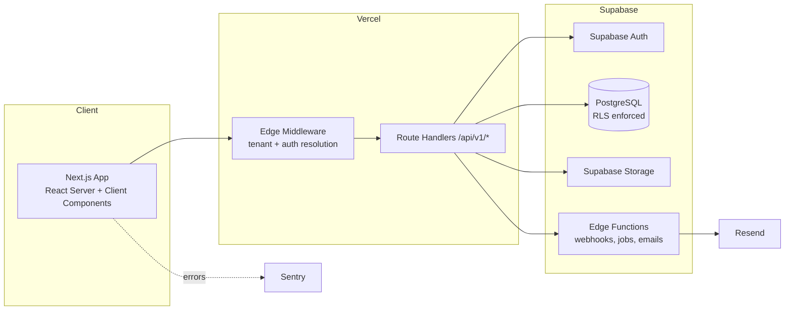

# STEMORA — Platform Architecture

Owner: Lead Software Engineer / Product Designer / DevOps / Security / DB Architect (Claude)
Last updated: 2026-08-03

STEMORA is a STEM Club management platform. A school signs up, gets an isolated
workspace, and runs **one** STEM Club inside it. The MVP is scoped to a single
piloting school (GMIS Jakarta), with the same product expanding to more schools
after the pilot.

## The model

```
Platform          STEMORA staff — sees which schools are on the platform
   ↓
School            One isolated workspace, one School Admin
   ↓
ONE STEM Club     Everything below belongs directly to this club
   ↓
Students          Projects · Tasks · Competitions · Resources · Events · Announcements
```

There is no club table, no club id, and no way for a student to belong to two
clubs — because there is only ever one. Subject areas (Robotics, Programming,
Artificial Intelligence, Engineering, Electronics, Mathematics, Research,
Physics, Environmental Science) are **project categories**: an attribute of a
project, never a group students join.

A project has a **project leader**. That is a property of the project, not a
role on the account — the student still signs in as a Student.

## How this document set is organized

| Doc | Covers |
|---|---|
| [docs/architecture/milestones-and-roadmap.md](docs/architecture/milestones-and-roadmap.md) | Milestones, MVP → production roadmap, launch gates |
| [docs/architecture/database-schema.md](docs/architecture/database-schema.md) | Full data model, DDL, indexes, RLS strategy |
| [docs/architecture/folder-structure.md](docs/architecture/folder-structure.md) | Repo layout, feature-first architecture |
| [docs/architecture/routes-and-pages.md](docs/architecture/routes-and-pages.md) | Every route, page, and layout, by audience |
| [docs/architecture/authentication.md](docs/architecture/authentication.md) | Signup/login/invite/session flows |
| [docs/architecture/rbac.md](docs/architecture/rbac.md) | Roles, permission matrix, enforcement layers |
| [docs/architecture/multi-tenancy.md](docs/architecture/multi-tenancy.md) | Tenant resolution, isolation guarantees |
| [docs/architecture/api-structure.md](docs/architecture/api-structure.md) | Route handler conventions, Edge Functions, versioning |
| [docs/architecture/component-library.md](docs/architecture/component-library.md) | Design system, shared components, states |

## System at a glance



## Core architectural commitments

1. **One school, one STEM Club.** Every tenant-owned row carries `school_id`,
   and `school_id` is the club boundary. No query, index, or RLS policy is
   written without it. See [multi-tenancy.md](docs/architecture/multi-tenancy.md).
2. **Three roles, no more.** `platform_owner`, `school_admin`, `student`.
   See [rbac.md](docs/architecture/rbac.md).
3. **Authorization is server-side and DB-side, always.** Client-side role checks
   are UX sugar only.
4. **Feature-first, not layer-first.** Business logic lives in `features/*/server`,
   never in components. See [folder-structure.md](docs/architecture/folder-structure.md).
5. **Every screen ships with loading / empty / error / success states**, permission
   checks, validation, and responsive + accessible markup.
6. **Every number is derived.** Counts and progress are computed from the data
   they describe, never hand-written, so the UI cannot claim something the data
   contradicts.

## Feature scope

| Area | What it is | Status |
|---|---|---|
| Students | One roster for the club, by grade | MVP |
| Projects | Category, team, project leader, deadline, kanban board | MVP |
| Competitions | Register of entries, rosters, levels, and results | MVP |
| Events | Meetings, workshops, showcases, competition days | MVP |
| Resources | Files and links, filed by category | MVP |
| Announcements | One message to the whole club, pinnable | MVP |
| Achievements | Club awards earned by students | MVP |
| Student profile | Skills, certificates, awards, projects shipped | MVP |
| Platform console | Which schools are on STEMORA | MVP |

Full detail in [milestones-and-roadmap.md](docs/architecture/milestones-and-roadmap.md).

## Open decisions

1. **Tenant resolution: subdomain (`gmis.stemora.com`) vs. path-based
   (`stemora.com/gmis`).** Default chosen: **subdomain**. See
   [multi-tenancy.md](docs/architecture/multi-tenancy.md#tenant-resolution).
2. **Custom domains per school** — post-pilot; needs a Vercel domain + DNS
   verification flow.
3. **Data residency** — single Supabase project/region for all schools
   (default, simplest) vs. regional sharding for international schools.
   Default: single region, revisit if education-data-residency requirements
   surface.
