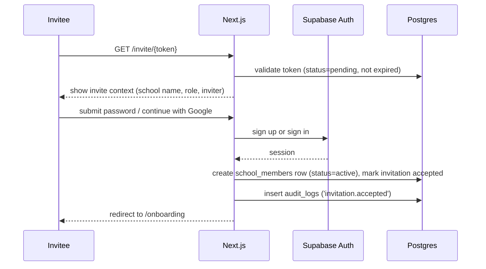
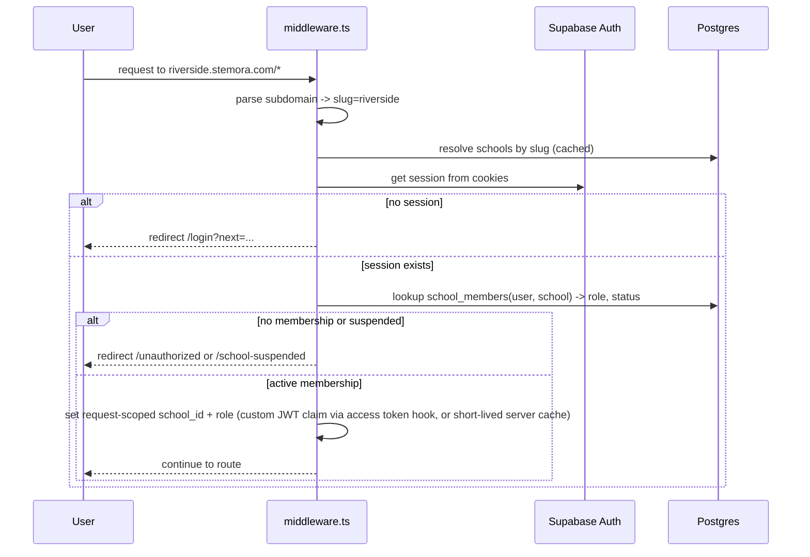

# Authentication

Built on Supabase Auth. Session cookies via `@supabase/ssr`, refreshed in
`middleware.ts` on every request so Server Components always see a valid
session without extra round trips.

## Identity providers

- Email + password (primary, works for younger students without external accounts)
- Google OAuth (fast path for school admins using school Google Workspace)
- Magic link (fallback / low-friction option for younger students, school-admin configurable per school in Phase 2)

MFA (TOTP) is **required for `platform_owner` and `school_admin`** starting
Phase 5 (before any school holds real student PII at scale); optional for
other roles.

## Signup is never open

There is no public "create an account" for the app itself — only two entry points:

1. **`/schools/new`** (marketing site): a prospective school admin registers →
   creates `schools` row (status `active`, or `pending` if manual vetting is
   desired) + a `users` row + `school_members` row with `role = school_admin`.
2. **`/invite/[token]`**: every other role (further school admins, students)
   is invited by someone with sufficient privilege (see
   [rbac.md](rbac.md#who-can-invite-whom)). Invitation creates a row in
   `invitations`, emailed via Resend, expires in 14 days, single-use token.

This closes the obvious abuse case of anyone self-registering into an
arbitrary school and is standard for education platforms (Google Classroom,
Canvas both work this way).

## Flow: accepting an invitation

## Flow: login + tenant + role resolution

The `school_id` and `role` used by RLS (`current_school_id()`,
`has_school_role()` in [database-schema.md](database-schema.md#row-level-security-strategy))
come from a **custom access token hook** (Supabase Auth Hook) that, on token
issuance/refresh, embeds the user's *currently active* school membership into
the JWT as custom claims. Because a user can belong to multiple schools, the
hook reads `users.last_active_school_id` to decide which membership to embed;
switching schools (school switcher in the topbar) updates
`last_active_school_id` and forces a token refresh.

## Email verification

Required before any tenant access (`auth.users.email_confirmed_at` must be
set). Unverified users land on `/verify-email` with a resend action
(rate-limited).

## Password requirements

Enforced client-side (zod) and re-validated server-side: minimum 10
characters, checked against the HaveIBeenPwned range API via Supabase Auth's
built-in leaked-password protection (enable in Supabase Auth settings).

## Session/security hardening

- Session lifetime: 1 hour access token, 30-day refresh token, refreshed
  silently by middleware.
- Sign-out revokes the refresh token server-side (not just cookie clearing).
- All auth events (`login`, `logout`, `password_reset`, `role_changed`,
  `invitation_sent/accepted/revoked`) are written to `audit_logs`.
- Rate limiting on `/login`, `/forgot-password`, `/invite/*` at the edge
  middleware layer (see [api-structure.md](api-structure.md#rate-limiting)) to
  blunt credential stuffing and invitation-enumeration.
- Suspicious login (new device/location) triggers an email notification via
  Resend — Phase 2.

## Onboarding (post first-login)

Role-specific multi-step wizard (`features/auth/components/OnboardingWizard`):

1. Confirm name, avatar.
2. Role-specific fields: students → grade level; school admins → department.
3. Suggested clubs to join (based on category interests selected).
4. Land on `/dashboard`.

Every step is skippable but re-prompted (non-blocking banner) until complete,
never a blocking modal the user can't escape.
