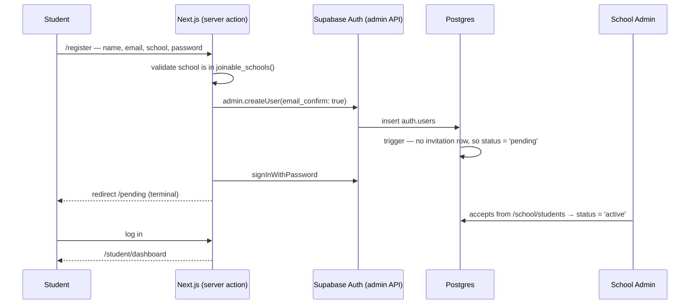

# Authentication

Built on Supabase Auth. Session cookies via `@supabase/ssr`, refreshed in
`middleware.ts` on every request so Server Components always see a valid
session without extra round trips.

This document describes what is **implemented**. Anything not described here
does not exist.

## Identity provider

**Email + password only.** There is no Google OAuth, no magic link, no SSO, and
no MFA. Adding one is a decision, not a gap to be filled in silently.

## The three roles

There are exactly three, defined in `src/config/roles.ts`:

| Role | Stored as | Gate that creates it |
|---|---|---|
| Platform Owner (Founder) | `users.platform_role = 'platform_owner'` | Provisioned by an administrator |
| School Admin (Club Head) | `school_members.role = 'school_admin'`, `status = 'active'` | Founder approves a school application |
| Student | `school_members.role = 'student'`, `status = 'active'` | School Admin accepts a join request |

One school → one STEM Club → students. There are no officers, mentors,
coordinators, or interest groups, and a school never has more than one club.
Project categories are metadata on a project, not a membership grouping.

A Platform Owner belongs to no school and holds no membership row, so they are
never also a School Admin or a student. There are two separate founder
accounts — never a shared one.

## Signup is never open

There is no public "create an account" that grants access to anything. Three
entry points exist, and each ends in someone else's decision:

### 1. Student asks to join — `/register` (Student tab)

Name, school email, a school chosen from the registered list, and a password.
The school list comes from `joinable_schools()`, a `SECURITY DEFINER` function
callable anonymously — it has to be, since the person reading it has no account
yet. The `schools` table itself stays readable only to members.

The account is created **server-side** through the Auth admin API with
`email_confirm: true`, so:

- **no confirmation email is sent, and none is required.** School Admin
  approval is the gate; proving control of a mailbox decides nothing here.
- there is **no fallback path**. If `SUPABASE_SERVICE_ROLE_KEY` is missing,
  registration fails with a configuration error and creates nothing — it never
  silently degrades to a weaker mechanism.

The membership lands at `pending` and opens nothing.

### 2. School applies — `/register` (School Admin tab)

Creates a `school_applications` row and an account. **No school row, no
membership, no School Admin** — those exist only once a Founder approves.
`/schools/new` is the old address for this form and now redirects here.

### 3. School Admin invites a student — `/school/students`

Writes an `invitations` row and sends a Supabase invitation email. The student
sets a password via `/auth/confirm` → `/reset-password`. There is **no
`/invite/[token]` route**; the emailed link is Supabase's own.

## How the database decides invited vs. requested

Signup metadata is written by whoever calls the signup endpoint, so a
`school_id` in it proves nothing. `handle_new_auth_user` grants `invited` only
when a matching **pending invitation row** exists — and only a School Admin can
write one. Anything else becomes `pending`, whatever the metadata claims. A
`school_id` posted straight at the Supabase signup endpoint therefore yields a
request, not access.

## School Admin succession

A STEM Club outlives the students running it, so leadership passes from one
cohort to the next without a Founder in the loop. Three operations, all decided
in the database:

| Function | Who may call it | Effect |
|---|---|---|
| `promote_to_school_admin(user)` | an active School Admin | an active student in **their own school** becomes `school_admin` |
| `demote_school_admin(user)` | an active School Admin | another admin returns to `student` |
| `step_down_as_school_admin()` | an active School Admin | gives up their own role |

Each function re-derives the acting admin's school from **their own membership**
rather than trusting an argument, so no shape of call reaches another school.
Nothing else moves: the same account, the same membership row, the same school.
Projects, tasks, achievements and profile are untouched — a former admin simply
carries on as a member of the club.

`protect_last_school_admin` is the floor. A school can never reach zero active
admins: the last one cannot step down, be demoted, be suspended, be removed, or
be deleted. The functions check first so the club head gets a sentence telling
them what to do instead ("Appoint another School Admin before stepping down"),
and the trigger refuses regardless if anything gets past that.

Founder approval creates a school's *first* School Admin and is not needed
again — succession after that is the club's own business.

### Audit trail

`activity_logs` records `school_admin_promoted`, `school_admin_demoted`, and
`school_admin_stepped_down` with the acting user, the affected user, the school,
the timestamp, and the roles moved between. It is **append-only**: rows are
written only inside the functions above, which run as the owner. No client role
holds `INSERT`, `UPDATE`, `DELETE`, or `TRUNCATE` on the table, and the only
policy is a `SELECT` for members of that school.

## Membership states

```
pending    student asked to join; opens nothing; needs the club head
invited    School Admin invited them; becomes active on email confirmation
active     can sign in and use the dashboard
suspended  paused by the School Admin; reversible
removed    closed, or a join request that was declined
```

`is_school_member()` and `has_school_role()` both require `status = 'active'`,
so a suspended or removed person loses data access on their very next request,
whatever cookie they still hold.

## Flow: student registration



## Flow: where a signed-in user lands

Every state resolves to exactly one destination, and the four end states are
terminal — they never redirect onward, which is what makes the graph loop-free.

| State | Destination | Terminal |
|---|---|---|
| `platform_role = 'platform_owner'` | `/platform/dashboard` | |
| membership `active` | `/school/dashboard` or `/student/dashboard` | |
| membership `pending` | `/pending` | yes |
| membership `invited` / `suspended` / `removed` | `/no-access` | yes |
| application `pending` | `/waitlist` | yes |
| application `rejected` | `/application-rejected` | yes |
| no membership, no application | `/register` | yes |

A rejected applicant may reapply: `submit_school_application` blocks only a
second *pending* request, so `/register` stays reachable for them while every
other path leads to `/application-rejected`.

This is enforced in two places that must agree — `middleware.ts` for the coarse
redirect and `landingForUserWithoutWorkspace()` in `src/lib/auth/session.ts`
for server components.

## Security model

**RLS is the boundary.** It is enabled on all 21 public tables. The route
guards (`requireSession`, `requireSchoolAdmin`, `requireStudent`) are for UX and
run server-side; they are not what stops a determined caller. Anyone can call
PostgREST directly with the anon key — it is published in the browser bundle by
design — so every rule below holds at the database.

**Role checks are server-side and read from the database.** `getSession()`
resolves role and school from Postgres on each request. Nothing about a role is
taken from the client, and there is no `localStorage` or `sessionStorage`
anywhere in the app.

**`platform_role` cannot be self-modified.** Two independent locks:

1. The `authenticated` role holds `UPDATE` on only `full_name` and
   `avatar_url` — table-level `UPDATE` and `INSERT` are revoked, so a
   `PATCH /rest/v1/users` touching `platform_role` is refused outright.
2. The `users_guard_platform_role` trigger rejects any change to the column
   from an application role even if a grant were restored later.

Founder accounts are provisioned by an administrator through the SQL editor or
the service role. There is deliberately **no RPC** that grants the role, so
there is nothing for a compromised session to call.

**Founder approval controls whether a school exists.**
`approve_school_application` re-checks `is_platform_owner()` inside the
database, and it is the only path that inserts a `schools` row plus its
`school_admin` membership. `submit_school_application` refuses anyone who
already belongs to a school, so no student can create one.

**School Admin approval controls student access.** `members_write` requires
`has_school_role(school_id, 'school_admin')` on both `USING` and `WITH CHECK`,
so a pending student cannot alter their own `status` or `role`.
`decideJoinRequest` additionally filters on `status = 'pending'`, so a decision
cannot be replayed.

**The service role key is server-only.** Read solely by
`src/lib/supabase/admin.ts`, which carries `import "server-only"` — importing it
from a Client Component is a build error. It is never prefixed `NEXT_PUBLIC_`,
so Next.js will not inline it into the browser bundle.

## Email verification

- **Students: not required and never sent.** Accounts are created already
  confirmed.
- **School applicants: confirmed server-side** where the service role key
  allows, so the founders' review is the only thing that gates them.
- Password resets still send mail, via `/forgot-password` → `/reset-password`.

## Password requirements

Minimum 8 characters, enforced client-side and re-validated in the server
action. Supabase's leaked-password protection (HaveIBeenPwned) is **not
currently enabled** — it is a single toggle in Auth settings and worth turning
on.

## Known gaps

Honest list, so nobody assumes these exist:

- No rate limiting on `/login` or `/register` beyond Supabase's defaults.
- No audit log of auth events. `activity_logs` exists but auth does not write
  to it.
- No session revocation beyond `signOut()`.
- No MFA.
